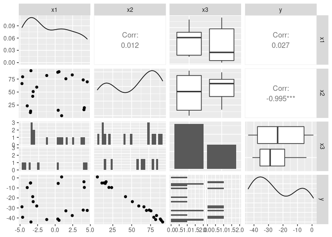
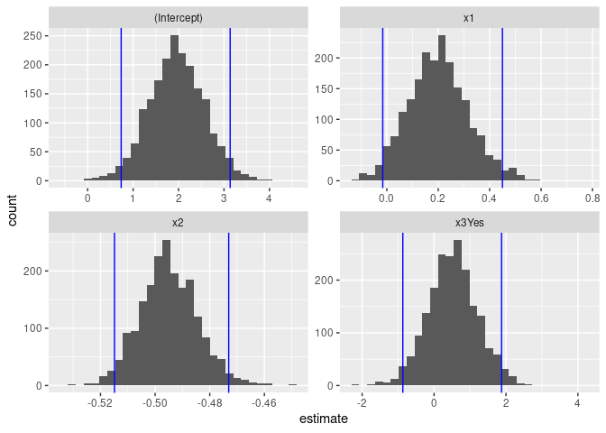

Activity 9 - Bootstrapping
================

## Task 2: Load the necessary packages

``` r
library(tidyverse)
library(tidymodels)
library(GGally)
```

## Task 3: Create the data

``` r
# Create a data frame/tibble named sim_dat
sim_dat <- tibble(
  # Generate 20 random numbers from a uniform distribution between -5 and 5 and store them in x1
  x1 = runif(20, -5, 5),
  # Generate 20 random numbers from a uniform distribution between 0 and 100 and store them in x2
  x2 = runif(20, 0, 100),
  # Generate 20 binary outcomes with a probability of success of 0.5 and store them in x3
  x3 = rbinom(20, 1, 0.5)
)

# Define the values of the regression coefficients and the standard deviation of the errors
b0 <- 2
b1 <- 0.25
b2 <- -0.5
b3 <- 1
sigma <- 1.5

# Generate 20 random errors from a normal distribution with mean 0 and standard deviation sigma
errors <- rnorm(20, 0, sigma)

# Add a new variable y to sim_dat that is generated by applying the regression equation with errors to the predictor variables
# Also, convert the binary variable x3 to a categorical variable with "No" and "Yes" as the categories
sim_dat <- sim_dat %>% 
  mutate(
    y = b0 + b1*x1 + b2*x2 + b3*x3 + errors,
    x3 = case_when(
      x3 == 0 ~ "No",
      TRUE ~ "Yes"
    )
  )
```

2.  Based on the above code the baseline model is

$$
Y= 2+ 0.25X1 - 0.5X2 + X3 + Errors
$$

``` r
ggpairs(sim_dat)
```

    ## `stat_bin()` using `bins = 30`. Pick better value with `binwidth`.
    ## `stat_bin()` using `bins = 30`. Pick better value with `binwidth`.
    ## `stat_bin()` using `bins = 30`. Pick better value with `binwidth`.

<!-- -->

3.  

-   X1 and Y are not so correlated and the relationship does not look
    linear with a correlation-coefficient of “0.023”

-   X2 and Y seems to be very highly negatively correlated with a strong
    linear relationship with a correlation-coefficient of “-0.997”

-   X3 being a categorical value with only two values “yes” and “no”.
    The mean value for “Yes” is higher than “no” which suggests there is
    a positive relation between X3 and Y. But, since the mean values are
    not so different, X3 is not highly correlated with Y.

## Task 4: Traditional MLR model

``` r
mlr_fit <- linear_reg() %>%
  set_mode("regression") %>% 
  set_engine("lm") %>% 
  fit(y ~ x1 + x2 + x3, data = sim_dat)

# Also include the confidence intervals for our estimated slope parameters
tidy(mlr_fit, conf.int = TRUE)
```

    ## # A tibble: 4 × 7
    ##   term        estimate std.error statistic  p.value conf.low conf.high
    ##   <chr>          <dbl>     <dbl>     <dbl>    <dbl>    <dbl>     <dbl>
    ## 1 (Intercept)    1.96     0.701      2.80  1.29e- 2   0.475      3.45 
    ## 2 x1             0.197    0.108      1.83  8.63e- 2  -0.0315     0.425
    ## 3 x2            -0.495    0.0112   -44.2   3.71e-18  -0.519     -0.471
    ## 4 x3Yes          0.504    0.717      0.703 4.92e- 1  -1.02       2.02

4.  The results are close enough and accurate to population model. I
    have compared the coefficients of X1, X2 and the intercept from the
    results to the ones in population model.

## Task 5: Bootstrapping

``` r
# Set a random seed value so we can obtain the same "random" results
set.seed(631)

# Generate the 2000 bootstrap samples
boot_samps <- sim_dat %>% 
  bootstraps(times = 2000)

boot_samps
```

    ## # Bootstrap sampling 
    ## # A tibble: 2,000 × 2
    ##    splits          id           
    ##    <list>          <chr>        
    ##  1 <split [20/8]>  Bootstrap0001
    ##  2 <split [20/6]>  Bootstrap0002
    ##  3 <split [20/6]>  Bootstrap0003
    ##  4 <split [20/6]>  Bootstrap0004
    ##  5 <split [20/10]> Bootstrap0005
    ##  6 <split [20/10]> Bootstrap0006
    ##  7 <split [20/7]>  Bootstrap0007
    ##  8 <split [20/6]>  Bootstrap0008
    ##  9 <split [20/8]>  Bootstrap0009
    ## 10 <split [20/6]>  Bootstrap0010
    ## # … with 1,990 more rows

``` r
# Create a function that fits a fixed MLR model to one split dataset
fit_mlr_boots <- function(split) {
  lm(y ~ x1 + x2 + x3, data = analysis(split))
}

# Fit the model to each split and store the information
# Also, obtain the tidy model information
boot_models <- boot_samps %>% 
  mutate(
    model = map(splits, fit_mlr_boots),
    coef_info = map(model, tidy)
    )

boots_coefs <- boot_models %>% 
  unnest(coef_info)

boots_coefs
```

    ## # A tibble: 8,000 × 8
    ##    splits         id            model  term     estim…¹ std.e…² stati…³  p.value
    ##    <list>         <chr>         <list> <chr>      <dbl>   <dbl>   <dbl>    <dbl>
    ##  1 <split [20/8]> Bootstrap0001 <lm>   (Interc…  1.58    0.883    1.78  9.32e- 2
    ##  2 <split [20/8]> Bootstrap0001 <lm>   x1        0.172   0.158    1.09  2.93e- 1
    ##  3 <split [20/8]> Bootstrap0001 <lm>   x2       -0.499   0.0137 -36.3   8.29e-17
    ##  4 <split [20/8]> Bootstrap0001 <lm>   x3Yes     0.337   0.988    0.341 7.37e- 1
    ##  5 <split [20/6]> Bootstrap0002 <lm>   (Interc…  1.49    0.664    2.25  3.92e- 2
    ##  6 <split [20/6]> Bootstrap0002 <lm>   x1        0.0732  0.0910   0.804 4.33e- 1
    ##  7 <split [20/6]> Bootstrap0002 <lm>   x2       -0.481   0.0116 -41.4   1.07e-17
    ##  8 <split [20/6]> Bootstrap0002 <lm>   x3Yes     0.130   0.677    0.192 8.50e- 1
    ##  9 <split [20/6]> Bootstrap0003 <lm>   (Interc…  1.56    0.597    2.61  1.90e- 2
    ## 10 <split [20/6]> Bootstrap0003 <lm>   x1        0.163   0.107    1.52  1.49e- 1
    ## # … with 7,990 more rows, and abbreviated variable names ¹​estimate, ²​std.error,
    ## #   ³​statistic

``` r
boot_int <- int_pctl(boot_models, statistics = coef_info, alpha = 0.05)
boot_int
```

    ## # A tibble: 4 × 6
    ##   term         .lower .estimate .upper .alpha .method   
    ##   <chr>         <dbl>     <dbl>  <dbl>  <dbl> <chr>     
    ## 1 (Intercept)  0.738      1.95   3.14    0.05 percentile
    ## 2 x1          -0.0158     0.201  0.450   0.05 percentile
    ## 3 x2          -0.515     -0.495 -0.473   0.05 percentile
    ## 4 x3Yes       -0.868      0.514  1.88    0.05 percentile

``` r
ggplot(boots_coefs, aes(x = estimate)) +
  geom_histogram(bins = 30) +
  facet_wrap( ~ term, scales = "free") +
  geom_vline(data = boot_int, aes(xintercept = .lower), col = "blue") +
  geom_vline(data = boot_int, aes(xintercept = .upper), col = "blue")
```

<!-- -->
